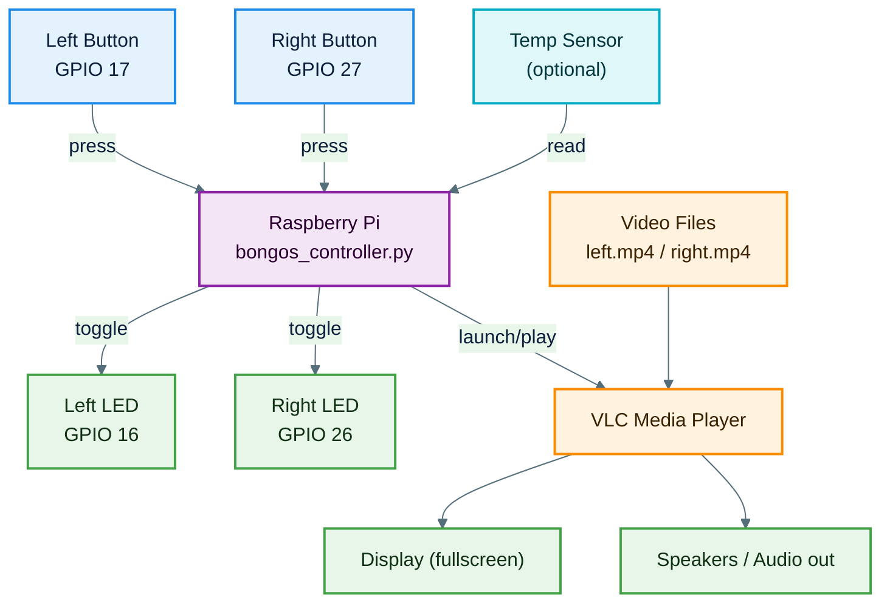
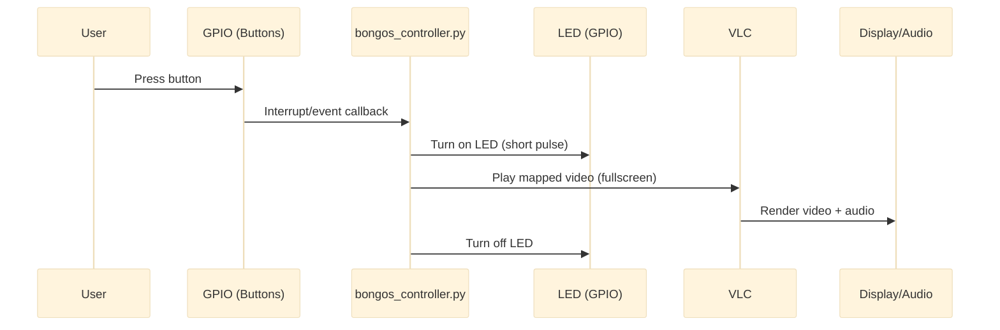
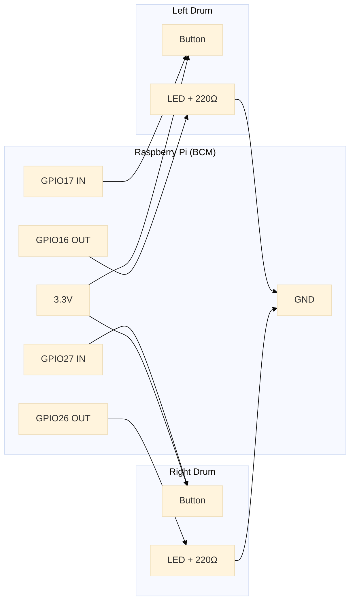

# ASD Interactive Bongos (Raspberry Pi Video Bongo System)

Individuals with Autism Spectrum Disorder (ASD) often respond well to **repetitive, rhythmic, and visual stimuli**. This project creates a simple, low-cost, and customizable **interactive bongo system** using a Raspberry Pi, buttons, LEDs, and video/audio feedback so that therapists, caregivers, or educators can deliver consistent, engaging interactions.

---

## What it does

- **Left button press**: left LED lights → `left.mp4` plays fullscreen (audio + video)
- **Right button press**: right LED lights → `right.mp4` plays fullscreen (audio + video)
- **Temperature sensor (optional/extension)**: periodically read ambient temperature (future ASD environment logging)

---

## Hardware (recommended)

- Raspberry Pi (3B+ or newer)
- 2× large push buttons (accessible "arcade" style recommended)
- 2× LEDs + 2× 220Ω resistors
- Jumper wires / breadboard (optional)
- Display/monitor + speakers (optional but recommended)
- Optional temperature sensor: **DS18B20 (1-Wire)** or an **I2C** temperature module

---

## GPIO Mapping (BCM Numbering)

| Function      | BCM GPIO                          |
|---------------|-----------------------------------|
| Left LED      | 16                                |
| Left Button   | 17                                |
| Right LED     | 26                                |
| Right Button  | 27                                |
| Temp Sensor   | depends on sensor (1-Wire or I2C) |

---

## Wiring (Quick Reference)

### Left Drum

- **GPIO 16 (OUT)** → LED anode (+)
  - LED cathode (−) → 220Ω resistor → **GND**
- **GPIO 17 (IN)** → button terminal 1
- **3.3V** → button terminal 2

### Right Drum

- **GPIO 26 (OUT)** → LED anode (+)
  - LED cathode (−) → 220Ω resistor → **GND**
- **GPIO 27 (IN)** → button terminal 1
- **3.3V** → button terminal 2

### Button Input Note (Important)

Because the button wiring connects the GPIO input to **3.3V when pressed**, the input must have a **pull-down** when not pressed (either a physical resistor or **internal pull-down in software**). Most builds use the internal pull-down.

### Temperature Sensor (Optional)

- **Power**: 3.3V + GND
- **Data**:
  - DS18B20: 1-Wire data pin to a 1-Wire GPIO + pull-up per datasheet
  - I2C module: SDA/SCL to Pi SDA/SCL

---

## Hardware Connection Diagram

```text
┌─────────────────────────────────────────────────────────────┐
│                       RASPBERRY PI                          │
│                                                             │
│  ┌──────────────────────────────────────────────────────┐   │
│  │              GPIO Pins (BCM Mode)                    │   │
│  │                                                      │   │
│  │  GPIO 16 ────────────┐                               │   │
│  │  GPIO 26 ────────────┤                               │   │
│  │  GPIO 17 ────────────┤                               │   │
│  │  GPIO 27 ────────────┤                               │   │
│  │  TEMP SENSOR (I2C / 1-Wire) ─────────────────────────│   │
│  │  GND ────────────────┤                               │   │
│  │  3.3V ───────────────┤                               │   │
│  └──────────────────────┼───────────────────────────────┘   │
└─────────────────────────┼───────────────────────────────────┘
                          │
          ┌───────────────┴───────────────┐
          │                               │
          ▼                               ▼
┌───────────────────┐           ┌───────────────────┐
│    LEFT DRUM      │           │    RIGHT DRUM     │
│                   │           │                   │
│  ┌─────────────┐  │           │  ┌─────────────┐  │
│  │   BUTTON    │  │           │  │   BUTTON    │  │
│  │  (GPIO 17)  │  │           │  │  (GPIO 27)  │  │
│  └──────┬──────┘  │           │  └──────┬──────┘  │
│         │         │           │         │         │
│  ┌──────▼──────┐  │           │  ┌──────▼──────┐  │
│  │     LED     │  │           │  │     LED     │  │
│  │  (GPIO 16)  │  │           │  │  (GPIO 26)  │  │
│  └─────────────┘  │           │  └─────────────┘  │
└───────────────────┘           └───────────────────┘
          │                               │
          └───────────────┬───────────────┘
                          ▼
             ┌────────────────────────┐
             │   COMMON GND & 3.3V   │
             └────────────────────────┘
                          ▲
                          │
               ┌──────────────────┐
               │   TEMP SENSOR    │
               │ (e.g., DS18B20   │
               │  or I2C sensor)  │
               └──────────────────┘
                          │
                          └──► 3.3V / GND & Data line → Raspberry Pi
```

---

## Colorful Flowcharts (GitHub Mermaid)

### System Architecture



---

### Runtime Event Flow (Button Press Sequence)



---

### Wiring Overview (High-Level)



---

## System Architecture (Text Diagram)

```text
┌─────────────────────────────────────────────────────────────┐
│                    USER & ENVIRONMENT                       │
│                                                             │
│   Press Left Button    Press Right Button    Room Temp      │
└───────────┬──────────────────┬──────────────────┬──────────┘
            │                  │                  │
            ▼                  ▼                  ▼
┌─────────────────────────────────────────────────────────────┐
│           RASPBERRY PI (bongos_controller.py)               │
│                                                             │
│  ┌──────────────────┐     ┌──────────────────┐             │
│  │  GPIO Handler    │     │  GPIO Handler    │             │
│  │  (Left Button)   │     │  (Right Button)  │             │
│  └────────┬─────────┘     └────────┬─────────┘             │
│           │                        │                        │
│           ▼                        ▼                        │
│  ┌──────────────────┐     ┌──────────────────┐             │
│  │  LED Controller  │     │  LED Controller  │             │
│  │  (GPIO 16)       │     │  (GPIO 26)       │             │
│  └──────────────────┘     └──────────────────┘             │
│                                                             │
│  ┌──────────────────────────────────────────────────────┐   │
│  │            Temperature Sensor Interface              │   │
│  │  - Reads temperature from external sensor            │   │
│  │  - Extension point for ASD environment monitoring    │   │
│  └──────────────────────────────────────────────────────┘   │
│                                                             │
│                ┌──────────────────────┐                     │
│                │    Video Player      │                     │
│                │  (VLC Media Player)  │                     │
│                └──────────┬───────────┘                     │
│                           │                                 │
│                           ▼                                 │
│                ┌──────────────────────┐                     │
│                │     Video Files      │                     │
│                │   - left.mp4         │                     │
│                │   - right.mp4        │                     │
│                └──────────────────────┘                     │
└───────────────────────────┬─────────────────────────────────┘
                            │
                            ▼
┌─────────────────────────────────────────────────────────────┐
│                      OUTPUT DEVICES                         │
│                                                             │
│      Display (Fullscreen Video)       Speakers (Audio)      │
└─────────────────────────────────────────────────────────────┘
```

---

## Installation (Raspberry Pi OS)

### Prerequisites

- Raspberry Pi OS + Python 3
- VLC installed
- `RPi.GPIO` available

### Step-by-Step

**1. Update system:**

```bash
sudo apt update
sudo apt upgrade -y
```

**2. Install VLC:**

```bash
sudo apt install -y vlc
```

**3. Install GPIO library:**

```bash
sudo apt install -y python3-rpi.gpio
```

**4. Clone or download this repository:**

```bash
git clone <repo-url>
cd ASD-Interactive-Bongos
```

**5. Put videos in the project folder:**

- `left.mp4`
- `right.mp4`

**6. Run:**

```bash
python3 bongos_controller.py
```

---

## Usage

1. **Start the system:**
   ```bash
   python3 bongos_controller.py
   ```

2. **Interact with the bongos:**
   - Press the **left button** → Left LED lights up → `left.mp4` plays
   - Press the **right button** → Right LED lights up → `right.mp4` plays

3. **Stop the system:** Press `Ctrl + C` in the terminal.

---

## Customization

| Setting         | How to Change                                                     |
|-----------------|-------------------------------------------------------------------|
| GPIO pins       | Edit `LEFT_LED`, `RIGHT_LED`, `LEFT_BUTTON`, `RIGHT_BUTTON`       |
| Video files     | Replace `left.mp4` / `right.mp4`                                  |
| LED duration    | Adjust `time.sleep(0.3)` in the callbacks                         |
| Debounce        | Modify `bouncetime=600` in `GPIO.add_event_detect`                |

---

## Troubleshooting

| Symptom                     | Solution                                                                           |
|-----------------------------|------------------------------------------------------------------------------------|
| No video / black screen     | Run on Pi's local display (not headless SSH). Verify VLC plays the MP4s normally. |
| Button triggers randomly    | Ensure pull-down is enabled (internal or external). Increase debounce time.       |
| LED doesn't light           | Verify LED polarity and series resistor to GND.                                   |

---

## Requirements

### Software

- Python 3.6+
- `RPi.GPIO` library
- VLC Media Player
- Raspberry Pi OS (or compatible Linux)

### Hardware

- Raspberry Pi (Model 3B+ or newer)
- 2× tactile push buttons
- 2× LEDs (any color)
- 2× 220Ω resistors
- Jumper wires
- Breadboard (optional)
- Display/monitor
- Speakers (optional)

---

## Contributing

Contributions are welcome! Ideas for improvement:

- Add more buttons/drums and a configurable mapping UI
- Add interaction logging (timestamps, counts, temperature)
- Add accessibility modes (longer LED pulse, simplified video set, timeout/lockout)
- Simple web interface for content management
- Data logging and analytics of interaction patterns

Feel free to open issues, fork the repository, and submit pull requests.

---

## License

Open source; intended for educational and therapeutic use.

---

## Acknowledgments

Designed with the needs of the autism community in mind, inspired by ASD therapy professionals and accessible, engaging sensory tools.
