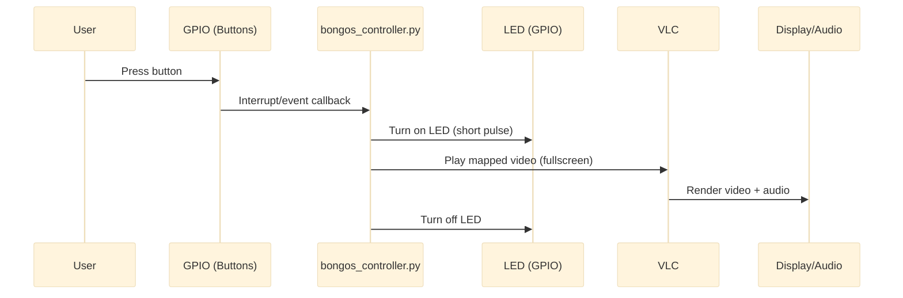

# ASD Interactive Bongos (Raspberry Pi Video Bongo System)

Individuals with Autism Spectrum Disorder (ASD) often respond well to **repetitive, rhythmic, and visual stimuli**. This project creates a simple, low-cost, and customizable **interactive bongo system** using a Raspberry Pi, buttons, LEDs, and video/audio feedback so that therapists, caregivers, or educators can deliver consistent, engaging interactions.

## What it does

- **Left button press**: left LED lights → `left.mp4` plays fullscreen (audio + video)
- **Right button press**: right LED lights → `right.mp4` plays fullscreen (audio + video)
- **Temperature sensor (optional/extension)**: periodically read ambient temperature (future ASD environment logging)

## Hardware (recommended)

- Raspberry Pi (3B+ or newer)
- 2× large push buttons (accessible “arcade” style recommended)
- 2× LEDs + 2× 220Ω resistors
- Jumper wires / breadboard (optional)
- Display/monitor + speakers (optional but recommended)
- Optional temperature sensor: **DS18B20 (1‑Wire)** or an **I2C** temperature module

## GPIO mapping (BCM numbering)

| Function | BCM GPIO |
|---|---:|
| Left LED | 16 |
| Left Button | 17 |
| Right LED | 26 |
| Right Button | 27 |
| Temp sensor | depends on sensor (1‑Wire or I2C) |

## Wiring (quick reference)

### Left drum

- **GPIO 16 (OUT)** → LED anode (+)  
  LED cathode (−) → 220Ω resistor → **GND**
- **GPIO 17 (IN)** → button terminal 1  
- **3.3V** → button terminal 2

### Right drum

- **GPIO 26 (OUT)** → LED anode (+)  
  LED cathode (−) → 220Ω resistor → **GND**
- **GPIO 27 (IN)** → button terminal 1  
- **3.3V** → button terminal 2

### Button input note (important)

Because the button wiring connects the GPIO input to **3.3V when pressed**, the input must have a **pull‑down** when not pressed (either a physical resistor or **internal pull‑down in software**). Most builds use the internal pull‑down.

### Temperature sensor (optional)

- **Power**: 3.3V + GND
- **Data**:
  - DS18B20: 1‑Wire data pin to a 1‑Wire GPIO + pull‑up per datasheet
  - I2C module: SDA/SCL to Pi SDA/SCL

## Colorful flowcharts (GitHub Mermaid)

### System architecture

```mermaid
%%{init: {'theme': 'base', 'themeVariables': {
  'primaryColor': '#E3F2FD',
  'primaryTextColor': '#0B1F3A',
  'primaryBorderColor': '#1E88E5',
  'lineColor': '#546E7A',
  'secondaryColor': '#E8F5E9',
  'tertiaryColor': '#FFF3E0'
}}}%%
flowchart TD
  LB[Left Button<br/>GPIO 17]:::input
  RB[Right Button<br/>GPIO 27]:::input
  TS[Temp Sensor<br/>(optional)]:::sensor

  PI[Raspberry Pi<br/>`bongos_controller.py`]:::compute

  LLED[Left LED<br/>GPIO 16]:::output
  RLED[Right LED<br/>GPIO 26]:::output
  VLC[VLC Media Player]:::media
  VID[Video Files<br/>`left.mp4` / `right.mp4`]:::media
  DISP[Display (fullscreen)]:::output
  AUD[Speakers / Audio out]:::output

  LB -->|press| PI
  RB -->|press| PI
  TS -->|read| PI

  PI -->|toggle| LLED
  PI -->|toggle| RLED
  PI -->|launch/play| VLC
  VID --> VLC
  VLC --> DISP
  VLC --> AUD

  classDef input fill:#E3F2FD,stroke:#1E88E5,stroke-width:2px,color:#0B1F3A;
  classDef sensor fill:#E0F7FA,stroke:#00ACC1,stroke-width:2px,color:#00343A;
  classDef compute fill:#F3E5F5,stroke:#8E24AA,stroke-width:2px,color:#2A0030;
  classDef output fill:#E8F5E9,stroke:#43A047,stroke-width:2px,color:#103014;
  classDef media fill:#FFF3E0,stroke:#FB8C00,stroke-width:2px,color:#3A2200;
```

### Runtime event flow (what happens on a button press)



### Wiring overview (high-level)

```mermaid
%%{init: {'theme': 'base'}}%%
flowchart LR
  subgraph PI[Raspberry Pi (BCM)]
    G16[GPIO16 OUT]
    G17[GPIO17 IN]
    G26[GPIO26 OUT]
    G27[GPIO27 IN]
    V33[3.3V]
    GND[GND]
  end

  subgraph L[Left Drum]
    LB[Button]
    LLED[LED + 220Ω]
  end

  subgraph R[Right Drum]
    RB[Button]
    RLED[LED + 220Ω]
  end

  G16 --> LLED
  G26 --> RLED
  G17 --> LB
  G27 --> RB
  V33 --> LB
  V33 --> RB
  LLED --> GND
  RLED --> GND
```

## Installation (Raspberry Pi OS)

### Prerequisites

- Raspberry Pi OS + Python 3
- VLC installed
- `RPi.GPIO` available

### Step-by-step

1. Update system:

```bash
sudo apt update
sudo apt upgrade -y
```

2. Install VLC:

```bash
sudo apt install -y vlc
```

3. Install GPIO library (recommended via apt on Raspberry Pi OS):

```bash
sudo apt install -y python3-rpi.gpio
```

4. Put videos in the project folder:

- `left.mp4`
- `right.mp4`

5. Run:

```bash
python3 bongos_controller.py
```

## Usage

- Press **left** button → left LED lights → `left.mp4` plays
- Press **right** button → right LED lights → `right.mp4` plays
- Stop with `Ctrl + C`

## Customization

- **Change pins**: edit `LEFT_LED`, `RIGHT_LED`, `LEFT_BUTTON`, `RIGHT_BUTTON` in `bongos_controller.py`
- **Change videos**: replace `left.mp4` / `right.mp4`
- **LED duration**: adjust the LED on-time in the callbacks
- **Debounce**: adjust `bouncetime` for your button hardware

## Troubleshooting

- **No video / black screen**: run on the Pi’s local display session (not a headless SSH session), verify VLC can play the MP4s normally.
- **Button triggers randomly**: ensure pull‑down is enabled (internal or external), and increase debounce.
- **LED doesn’t light**: verify LED polarity and series resistor to GND.

## Contributing

Contributions are welcome. Ideas:

- Add more buttons/drums and a configurable mapping UI
- Add interaction logging (timestamps, counts, temperature)
- Add accessibility modes (longer LED pulse, simplified video set, timeout/lockout)

## License

Open source; intended for educational and therapeutic use.

## Acknowledgments

Designed with the needs of the autism community in mind, inspired by ASD therapy professionals and accessible, engaging sensory tools.

## ASD Interactive Bongos – Raspberry Pi Video Bongo System

### 1. Problem Statement (Short)

Individuals with Autism Spectrum Disorder (ASD) often respond well to repetitive, rhythmic, and visual stimuli. However, it can be difficult to provide structured, engaging, and controllable sensory experiences using traditional tools. This project creates a simple, low-cost, and customizable interactive bongo system using a Raspberry Pi, buttons, LEDs, and video/audio feedback so that therapists, caregivers, or educators can deliver consistent, engaging interactions.

---

### 2. Hardware Connection Diagram

```text
┌─────────────────────────────────────────────────────────────┐
│                    RASPBERRY PI                             │
│                                                             │
│  ┌──────────────────────────────────────────────────────┐   │
│  │  GPIO Pins (BCM Mode)                                │   │
│  │                                                      │   │
│  │  GPIO 16 ────────────┐                             │     │
│  │  GPIO 26 ────────────┤                             │     │
│  │  GPIO 17 ────────────┤                             │     │
│  │  GPIO 27 ────────────┤                             │     │
│  │  TEMP SENSOR (e.g.,  I2C / 1-Wire) ────────────────┤     │
│  │  GND ────────────────┤                             │     │
│  │  3.3V ───────────────┤                             │     │
│  └──────────────────────┼─────────────────────────────┘     │
│                         │                                   │
└─────────────────────────┼─────────────────────────────────--┘
                          │
                          │
        ┌─────────────────┴─────────────────┐
        │                                   │
        ▼                                   ▼
┌───────────────┐                  ┌───────────────┐
│  LEFT DRUM    │                  │  RIGHT DRUM   │
│               │                  │               │
│  ┌─────────┐  │                  │  ┌─────────┐  │
│  │ BUTTON  │  │                  │  │ BUTTON  │  │
│  │ (GPIO17)│  │                  │  │ (GPIO27)│  │
│  └────┬────┘  │                  │  └────┬────┘  │
│       │       │                  │       │       │
│       │       │                  │       │       │
│  ┌────▼────┐  │                  │  ┌────▼────┐  │
│  │   LED   │  │                  │  │   LED   │  │
│  │ (GPIO16)│  │                  │  │ (GPIO26)│  │
│  └─────────┘  │                  │  └─────────┘  │
│               │                  │               │
└───────────────┘                  └───────────────┘
        │                                   │
        │                                   │
        └───────────┬───────────────────────┘
                    │
                    ▼
            ┌──────────────────────┐
            │  COMMON GND & 3.3V   │
            └──────────────────────┘

     ▲
     │
     │
┌───────────────┐
│ TEMP SENSOR   │
│ (e.g., DS18B20│
│  or I2C sensor│
└───────────────┘
      │  │
      │  └────► 3.3V / GND & Data line back to Raspberry Pi
```

---

### 3. Detailed Wiring Connections

#### Left Drum Circuit

**Raspberry Pi → Left Drum Components**

- **GPIO 16 (OUT)** → LED Anode (+)  
  LED Cathode (−) → 220Ω resistor → GND
- **GPIO 17 (IN)** → Button terminal 1  
- **3.3V** → Button terminal 2  
  Button connects GPIO 17 to 3.3V when pressed.

#### Right Drum Circuit

**Raspberry Pi → Right Drum Components**

- **GPIO 26 (OUT)** → LED Anode (+)  
  LED Cathode (−) → 220Ω resistor → GND
- **GPIO 27 (IN)** → Button terminal 1  
- **3.3V** → Button terminal 2  
  Button connects GPIO 27 to 3.3V when pressed.

#### Temperature Sensor Circuit

- Use a **digital temperature sensor** (e.g., DS18B20 1‑Wire or I2C module).  
- Connect **3.3V** and **GND** from Raspberry Pi to the sensor’s power pins.  
- Connect the sensor **data pin** to the appropriate Raspberry Pi data pin (1‑Wire GPIO or I2C pins such as SDA/SCL), with a pull‑up resistor if needed according to the sensor datasheet.  
- The Raspberry Pi reads this temperature value periodically and can later be used to extend the project into an ASD‑focused environmental monitoring system.

#### Physical Integration

- **Button placement**: Mount large, accessible buttons on the drum heads or sides.  
- **LED placement**: Position LEDs where they are clearly visible but not distracting.  
- **Wiring**: Route wires through the drum structure or enclosure to keep them protected.  
- **Power**: Use a stable power supply for the Raspberry Pi (recommended: 5V, 3A adapter).

---

### 4. System Architecture

```text
┌─────────────────────────────────────────────────────────────┐
│                    USER & ENVIRONMENT                       │
│                                                             │
│   Press Left Button   Press Right Button   Room Temperature │
│          │                    │                    │        │
└──────────┼────────────────────┼────────────────────┼────────┘
           │                    │                    │
           ▼                    ▼                    ▼
┌─────────────────────────────────────────────────────────────┐
│              RASPBERRY PI (bongos_controller.py)            │
│                                                             │
│  ┌──────────────────┐          ┌──────────────────┐         │
│  │  GPIO Handler    │          │  GPIO Handler    │         │
│  │  (Left Button)   │          │  (Right Button)  │         │
│  └────────┬─────────┘          └────────┬─────────┘         │
│           │                              │                  │
│           ▼                              ▼                  │
│  ┌──────────────────┐          ┌──────────────────┐         │
│  │  LED Controller  │          │  LED Controller  │         │
│  │  (GPIO 16)       │          │  (GPIO 26)       │         │
│  └──────────────────┘          └──────────────────┘         │
│                                                             │
│  ┌──────────────────────────────────────────────────────┐   │
│  │  Temperature Sensor Interface                        │   │
│  │  - Reads temperature from external sensor            │   │
│  │  - (Extension point for ASD behavior/environment)    │   │
│  └──────────────────────────────────────────────────────┘   │
│                       │                                     │
│           └───────────┴───────────────────────────────┐     │
│                                                       ▼     │
│           ┌──────────────────────┐                          │
│           │  Video Player        │                          │
│           │  (VLC Media Player)  │                          │
│           └──────────┬───────────┘                          │
│                      │                                      │
│                      ▼                                      │
│           ┌──────────────────────┐                          │
│           │  Video Files         │                          │
│           │  - left.mp4          │                          │
│           │  - right.mp4         │                          │
│           └──────────────────────┘                          │
└────────────────────────┬────────────────────────────────────|
                         │
                         ▼
┌─────────────────────────────────────────────────────────────┐
│                    OUTPUT DEVICES                           │
│                                                             │
│         Display (Fullscreen Video)    Speakers (Audio)      │
└─────────────────────────────────────────────────────────────┘
```

**Explanation**

- Button presses on the left/right drums are read by the Raspberry Pi GPIO pins.  
- A temperature sensor connected to the Raspberry Pi provides ambient temperature data, which can be used to extend the system into an ASD behavior-vs-environment monitoring tool.  
- `bongos_controller.py` detects button events, lights the corresponding LED, and triggers VLC to play the mapped video (`left.mp4` or `right.mp4`) in fullscreen.  
- The display shows the video, and speakers output the audio, creating an engaging interactive experience.

---

### 5. Installation

#### Prerequisites

- Raspberry Pi with Raspberry Pi OS installed.  
- Python 3 (usually pre-installed).  
- VLC Media Player installed.  
- `RPi.GPIO` library installed.  

#### Step-by-Step Setup

1. **Update your system:**

   ```bash
   sudo apt update
   sudo apt upgrade -y
   ```

2. **Install VLC Media Player:**

   ```bash
   sudo apt install vlc -y
   ```

3. **Install Python GPIO library:**

   ```bash
   pip3 install RPi.GPIO
   ```

4. **Clone or download this repository:**

   ```bash
   git clone <repository-url>
   cd ASD-Interactive-Bongos
   ```

5. **Prepare video files:**

   - Place your video files in the project directory.  
   - Name them `left.mp4` and `right.mp4`.  
   - Ensure videos are in a format compatible with VLC.

6. **Connect the hardware** according to the wiring and hardware diagram above.

7. **Run the controller:**

   ```bash
   python3 bongos_controller.py
   ```

---

### 6. Usage

1. **Start the system:**

   ```bash
   python3 bongos_controller.py
   ```

2. **Interact with the bongos:**

   - Press the **left button** → Left LED lights up → `left.mp4` plays.  
   - Press the **right button** → Right LED lights up → `right.mp4` plays.  

3. **Stop the system:**

   - Press `Ctrl + C` in the terminal to gracefully stop the program.

---

### 7. Customization

- **Change video files**: Replace `left.mp4` and `right.mp4` with your own videos.  
- **Modify GPIO pins**: Update `LEFT_LED`, `RIGHT_LED`, `LEFT_BUTTON`, `RIGHT_BUTTON` in `bongos_controller.py` if you use different pins.  
- **Adjust LED timing**: Change `time.sleep(0.3)` in the callbacks to control how long LEDs stay on.  
- **Adjust debounce**: Modify `bouncetime=600` in `GPIO.add_event_detect` to tune button debounce behavior.

---

### 8. Requirements

#### Software

- Python 3.6+  
- `RPi.GPIO` library  
- VLC Media Player  
- Raspberry Pi OS (or compatible Linux distribution)  

#### Hardware

- Raspberry Pi (Model 3B+ or newer recommended).  
- 2× tactile push buttons.  
- 2× LEDs (any color).  
- 2× 220Ω resistors.  
- Jumper wires.  
- Breadboard (optional).  
- Display/monitor.  
- Speakers (optional, for audio output).  

---

### 9. Contributing

Contributions are welcome. Possible improvement areas:

- Additional sensory feedback (vibration, more LEDs, sounds).  
- Support for more buttons/drums and more videos.  
- Simple web interface for content management.  
- Data logging and analytics of interaction patterns.  
- Accessibility and usability improvements.  

Feel free to open issues, fork the repository, and submit pull requests.

---

### 10. License

This project is open source and intended for educational and therapeutic use.

---

### 11. Acknowledgments

- Designed with the needs of the autism community in mind.  
- Inspired by ASD therapy professionals and accessible, engaging sensory tools.  

# Interactive-Dashboard-for-ASD

